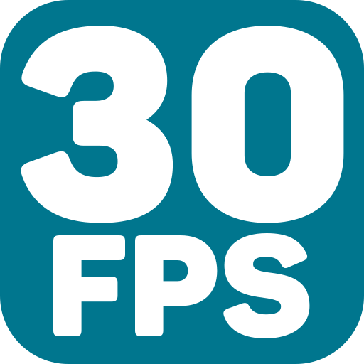

<br>

# FPS Manager 

Set a hard limit on the maximum FPS of your game. Originialy made by Skymen.

Author: Master Pose <br>
Website: [https://masterpose.itch.io/fps-manager-c3](https://masterpose.itch.io/fps-manager-c3) <br>
Addon Url: [https://masterpose.itch.io/fps-manager-c3](https://masterpose.itch.io/fps-manager-c3) <br>
Download Latest Version : [Version: 1.0.0.0](https://github.com/MasterPose/c3-fps-manager/releases/latest) <br>

<br>

<sub>

Made using [c3-framework](https://github.com/C3Framework/framework) 

</sub>

## Table of Contents

- [Usage](#usage)
- [Examples Files](#examples-files)
- [Properties](#properties)
- [Actions](#actions)
- [Conditions](#conditions)
- [Expressions](#expressions)

---

## Usage

First you must install the dependencies via NPM using:

```
npm install
```

To build the addon, run the following command:

```
npx c3fo build
```

To start the dev server, run:

```
npx c3fo build -D
```

The build uses the `addon.ts` file for the configurations and the `runtime.ts` file as the entry point to generate everything else.
The files defined with `@AceClass` contain all the Actions, Conditions and Expressions logic and configuration, you may want to check them. 

## Examples Files

- [demo](./examples/demo.c3p)
<br>

---

## Properties

| Property Name | Description | Type |
| --- | --- | --- |
| Max Framerate | Sets the maximum framerate your game can run on. (Set 0 to disable). | integer |

---

## Actions

| Action | Description | Params |
| --- | --- | --- |
| Set max framerate | Sets the maximum framerate your game can run on. (Set 0 to disable). | Limit *(number)* <br> |
| Set framerate mode | Sets the framerate mode. | Mode *(combo)* <br> |
| Disable max framerate | Disables the max framerate. |  |

---
## Conditions

| Condition | Description | Params |
| --- | --- | --- |
| On change max framerate | Triggers when a new framerate has been chosen. |  |
| On change framerate mode | Triggers when a new framerate mode has been chosen. |  |

---
## Expressions

| Expression | Description | Return Type | Params |
| --- | --- | --- | --- |
| maxFramerate | Returns the configured maximum framerate, returns 0 when disabled. | number |  |
| framerateMode | Returns the framerate mode or "disabled" if the plugin is disabled. | string |  |
